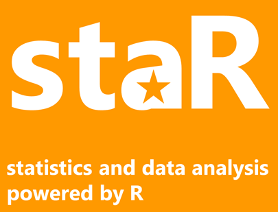

# staR
#### Statistics and Data Analysis Powered by R

staR is free software for performing basic statistical and data analysis tasks. It is primarily designed as a support tool for teaching introductory courses in data analysis for the social sciences, or other social science courses requiring data analysis tasks.

Learning from my [decade-long experience](http://docenti.luiss.it/desio/) in teaching introductory courses on data analysis, I designed staR to be...

#### Easy to use
allowing users to focus on key aspects of social science research (understanding social reality; theory and hypotheses, concepts, research design, indicators, choice of appropriate statistical tools) rather than force them to invest time and resources in learning a complex programming language, whose power might not necessarily be needed;
#### Easy to be employed in teaching
providing a simple command syntax with simple options, rather than requiring either: (a) to learn and teach complex menu and window systems (looking for options hidden in minor buttons or dialog boxes) or (b) to learn a complex programming language designed for much more than simple data analysis;
also, producing output that is easy and consistent to copy and paste across applications (to also help perform assignments);
#### Easy to extend
allowing instructors to extend it to implement the data analysis techniques they may need for their particular course;
#### Standards-based
helping instructors to provide students with skills that they may reuse, perhaps on professional statistical tools used in the academia and business;
#### Free (and open source)
offering a free tool to students (whose perhaps occasional use of statistical tools should not require expensive licenses) and to university departments (removing the requirement of massive license investments for introductory teaching);
providing an open source tool, open to amendments and extensions by the scientific community.

## Features
staR addresses the above challenges by providing a web-based app that allows users to open datasets and perform basic statistical operations by using the following commands, which act as basic functional equivalents of the same commands supported by the commercial Stata ® software.*

`use, browse, doedit, drop, keep, generate, replace, recode, tab1, summarize, histogram, tab2, scatter, regress, logit, help`

`by, if`

Typing `doedit` will show a code editor and load a test document showing some of staR's capabilities.

### Stata-to-R translation
staR is inherently based on a set of "translation" scripts that generate R syntax implementing the statistical operations corresponding to the supplied Stata-like syntax, to be forwarded to an R server for execution.
A key by-product of this process is that such generated R syntax can be shown to the user, which can be useful in teaching R equivalent syntax of common operations, leveraging common R packages.
To see the generated syntax, simply append the `rsyntax` option to any Stata command you run in the command pane.

(* Stata ® is a registered trademark of StataCorp LP.)

## Installation

### Single-machine use (recommended for instructor evaluation, or for advanced users)

* ensure you have a recent version of R installed (we performed internal testing with R 4.0.2);
* download staR from https://github.com/ldesio/staR/archive/master.zip and unzip this file into a directory of your choice
(or clone the https://github.com/ldesio/staR/ repository if you use GitHub);
* move to the `staR-master/app` subdirectory;
* there, run `_setup.R` in R (or RStudio) only the first time, to download and install required packages;
* to run staR, run `staR_plumber.R` in the same directory, and then point your browser to http://localhost:8000/ ;
* Please remember to close both your browser *and* R (or RStudio) after each session, to avoid an R instance stay alive and use system resources.

### Setting up a staR server allowing student access

This is possible by setting up a Docker container on your provider of choice (usually supported by most university IT systems):
* pull the staR Docker image from https://registry.hub.docker.com/r/lorenzodesio/star/ ;
* create and start a Docker container based on this image;
* annotate the public URL of this container;
* navigate to it to test staR; share this URL with students.

NOTE: users connecting to a staR server can currently only use Stata-format datasets located at publicly accessible URLs; you will have to set up necessary datasets accordingly.

NOTE 2: a staR server consists of an R instance living in a Linux server. As R is single-threaded, this means that a large number of concurrent users might lead to server overload. Before using staR with large classes, you are strongly advised to run multi-user performance tests. In any case, performance problems can be easily solved by setting up multiple servers, by assigning users to different servers, or by using more sophisticated tools (e.g. automatic multiplication of server instances, along with automatic load balancing) which are ordinarily available in Docker hosting environments.

## staR architecture and extensibility
staR is powered by R. In particular, it provides a web-based (HTML, JavaScript) interface that:

* accepts Stata-like syntax;
* forwards this input to dedicated JavaScript scripts that generate corresponding R syntax (e.g. the translation to R of `regress` Stata syntax is implemented in `regress.js`);
* sends this generated code to an R server instance, and collects and formats output;

As a result, staR is very easy to extend. New commands (meant as functional equivalents of their Stata counterparts) can be easily added by simply adding JavaScript scripts receving Stata syntax and providing a corresponding R translation.

Given the power of R, the implementation of a command is in most cases a matter of selecting the appropriate package and just adding some translation and integration code. This allows any instructor with a knowledge of R to extend the system for their specific teaching purposes.

While more documentation on extending staR will be provided in the future, my suggestion is to start by looking at examples in the `app/static/commands/` directory. Implementing a new command simply requires adding a `<command>.js` file in the same directory, which will be launched when typing `<command>` in staR's command window. No reloading of staR's web interface is required for loading the new command script or when saving changes to the script.
